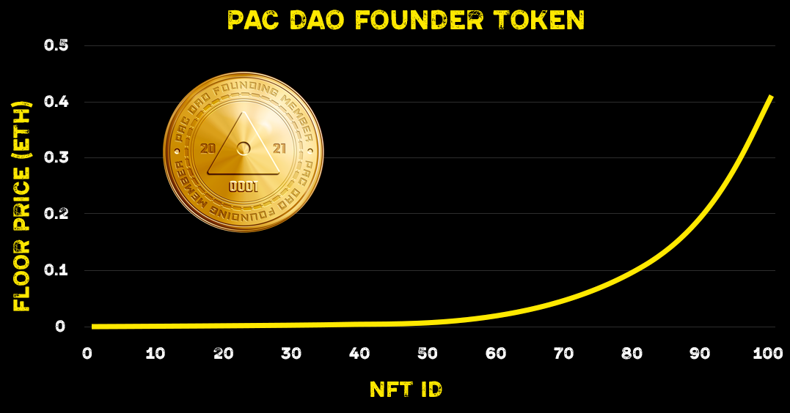

# PAC DAO FOUNDER

Mint a Founder Token for PAC DAO

* [🌐  Web](https://pac.xyz/)
* [🎮  Discord ](https://discord.gg/tbBKXQqm)
* [🛫  Telegram ](https://t.me/joinchat/VYYqN19O3Wc4OTZh)
* [🦅  Twitter](https://twitter.com/pacdao)

## Mechanics

An ERC-721 NFT that doesn’t do anything or confer any special rights.  It’s just a way to receive a memento of support for promoting a good cause.  All proceeds are being used to fund the DAO, which is planning action campaigns in accordance with its mission: PAC is not actually a Political Action Committee, but an issue group that stands for People Advocating for Crypto.

The initial mint price is very cheap, well below price of gas. However, the floor price increases by at least 7.5% after each mint, so early supporters get a nice discount.  Additionally, the DAO address receives 10 additional tokens at the time of deployment to distribute to the community as desired.

The other aspect built into the minting mechanics is that anybody who likes can choose to raise the stakes by minting at any amount above the floor price.  Should some whale choose to do this, the new floor price would raise accordingly, and the supply would be massively curtailed.

Even if people just mint at floor price, the effective supply is effectively scarce.

In reality these numbers could be higher if whales choose to accelerate the floor price.  These are the experimental results derived from the Brownie tests.  

Assuming everybody just mints at floor price, the badge will be cheaper than gas for about the first 50 coins.  By NFT 100, the token will cost about half an ETH.  By 200, only millionaires will be able to afford it.  By 300, only billionaires will be able to afford it.  The theoretical cap is some number shortly thereafter when overflow errors would prevent minting.  Practically, it would be a pleasant surprise if a hundred get minted.

Live at: [0x63994b223f01b943eff986b1b379312508dc15f8](https://etherscan.io/address/0x63994b223f01b943eff986b1b379312508dc15f8)
